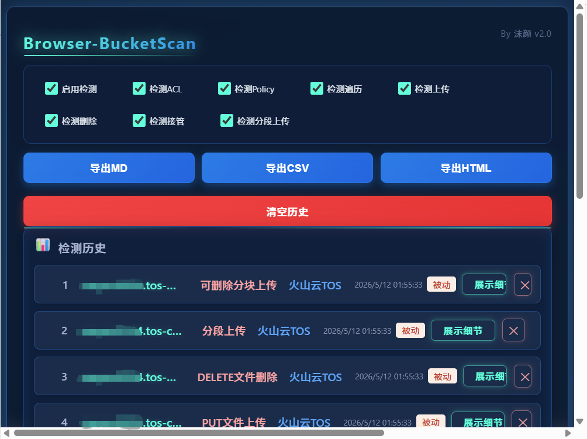
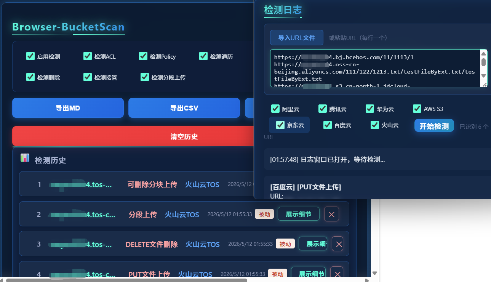
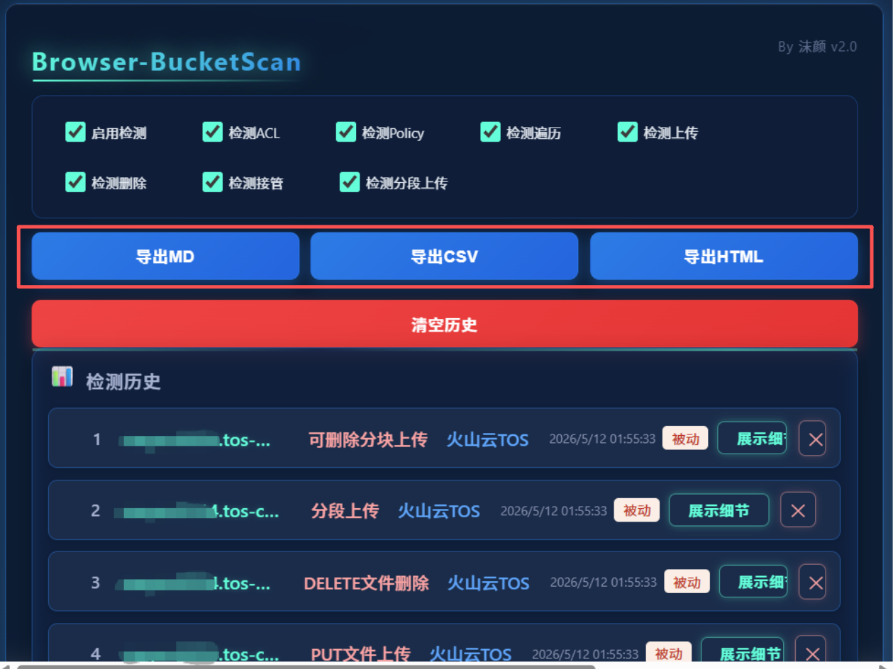
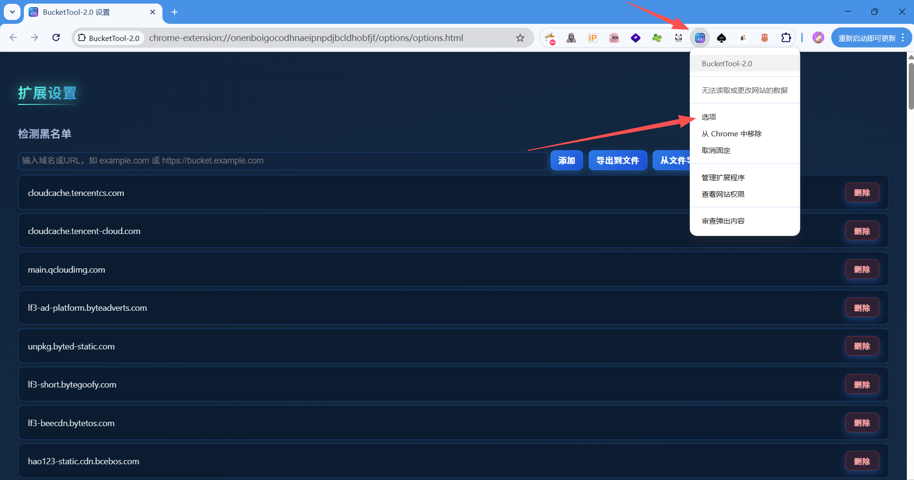
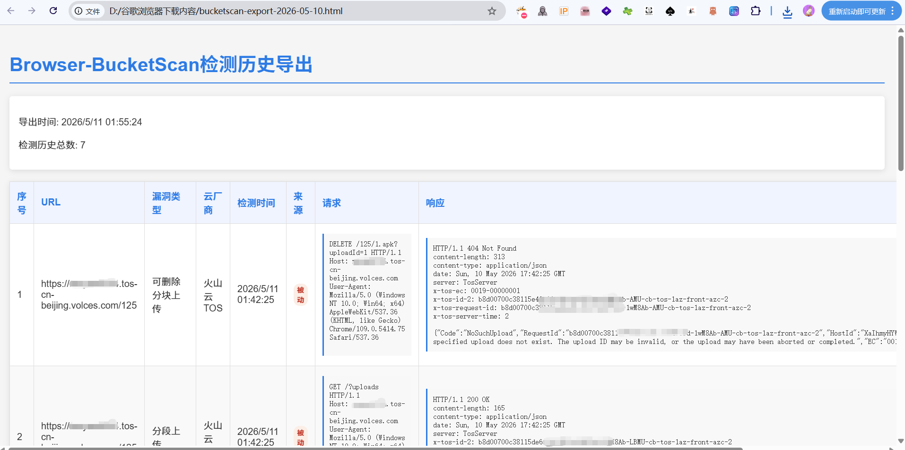

# Browser-BucketScan

## 项目简介

Browser-BucketScan 是一款轻量易用的浏览器扩展工具，专为云存储桶安全检测设计，适配主流浏览器环境（摆脱 BurpSuite 版本兼容限制），可全面检测**阿里云 OSS、腾讯云 COS、华为云 OBS、AWS S3、京东云 OSS、百度云 BOS、火山引擎 TOS** 七种主流云存储桶的核心安全漏洞。

## 主要功能
- 一键全覆盖检测存储桶高危漏洞，涵盖存储桶可遍历、PUT文件上传、DELETE文件删除、存储桶可接管、分段上传、可删除分块上传、可合并分块上传、Policy可写、对象ACL可读、桶ACL可读、对象ACL可写、桶ACL可写等核心风险点
- 全面适配七大主流云存储厂商：阿里云OSS、腾讯云COS、华为云OBS、AWS S3、京东云OSS、百度云BOS、火山引擎TOS
- 检测结果实时日志可视化展示，同时生成结构化历史记录，便于追溯核查
- 检测结果红点醒目提醒，点击弹窗即可快速查阅历史检测数据
- 差异化日志输出策略：主动检测时输出完整详细日志，被动检测仅写入历史记录，兼顾排查效率与数据留存
- 精细化检测控制：支持各项检测功能独立开关控制，可根据实际需求灵活开启/关闭指定检测项
- 多格式数据导出：支持将检测历史完整导出为JSON、CSV、HTML格式，包含漏洞详情、检测参数及完整数据包，满足不同场景分析需求
- **批量主动检测**：支持导入URL文件或粘贴多行URL进行批量自动检测，自动识别云厂商，检测结果实时展示

## 插件优点

- **跨浏览器支持**：兼容 Chrome、Edge 等主流浏览器，无需安装额外软件
- **便捷易用**：作为浏览器扩展，随时可用，无需配置复杂环境
- **实时检测**：被动检测模式下自动检测网页中的云存储桶，无需手动输入
- **全面覆盖**：支持阿里云 OSS、腾讯云 COS、华为云 OBS、AWS S3、京东云 OSS、百度云 BOS、火山引擎 TOS 七大主流云存储服务，覆盖范围广
- **支持MINIO检测**：支持检测MINIO对象存储服务，扩展检测范围
- **精准识别**：基于七大云厂商响应头中request-id特征进行匹配校验，有效降低漏洞检测误报率
- **黑名单管理**：支持黑名单检测机制，可手动添加黑名单域名，同时支持 TXT 格式黑名单的导入与导出，灵活过滤无需检测的目标
- **详细报告**：检测结果包含完整的请求 / 响应数据包，便于深入分析
- **灵活配置**：可根据需求开启 / 关闭各项检测功能，节省资源
- **多种导出格式**：支持 Markdown(MD)、CSV、HTML 三种格式导出，满足不同场景需求
- **安全可靠**：匿名访问检测，不会携带用户凭证，保护用户隐私
- **持续更新**：定期优化检测逻辑，添加新功能和云厂商支持
- **直观界面**：科幻风格设计，美观易用，提升用户体验

## 支持的云厂商
- 阿里云 OSS
- 腾讯云 COS
- 华为云 OBS
- AWS S3（含中国区）
- 京东云
- 百度云 BOS
- 火山云 TOS
- MINIO

## 使用方法
1. **安装扩展**：
   - 在 Chrome/Edge 浏览器扩展管理页面（chrome://extensions/）开启开发者模式，加载本项目目录。
2. **主动检测**：
   - 点击扩展图标，打开日志窗口，输入存储桶URL，点击”开始检测”。
   - **批量检测**：支持在日志窗口粘贴多行URL（每行一个），或导入 `.txt` 文件，自动逐个检测并实时显示结果。
   - 检测过程和结果会实时显示在日志窗口。
3. **被动检测**：
   - 浏览器访问页面时自动检测 URL 中的云存储桶，发现漏洞会在历史中记录并红点提醒。

## 主要界面说明
- **主动批量检测**：支持在日志窗口粘贴多行URL（每行一个），或导入 `.txt` 文件，自动逐个检测并实时显示结果。
  
  - **打开方式**：点击扩展图标，或右键点击扩展图标选择"用 Browser-BucketScan 检测"

  

  

- **检测开关**：位于扩展弹窗顶部，可灵活控制各项检测功能的开启/关闭。
  - 启用检测：控制是否启用插件检测功能
  - 检测ACL：控制是否检测ACL配置
  - 检测Policy：控制是否检测Policy配置
  - 检测遍历：控制是否检测存储桶可遍历
  - 检测上传：控制是否检测PUT文件上传
  - 检测删除：控制是否检测DELETE文件删除
  - 检测接管：控制是否检测桶接管风险
  - 检测分段上传：控制是否检测分段上传功能
  
- **历史记录**：记录所有检测到的漏洞。
  

- **导出功能**：位于扩展弹窗顶部，直接点击按钮即可导出检测历史。
  
  - 导出MD：Markdown格式，包含完整漏洞信息和数据包，便于文档化
  
  - 导出CSV：表格数据，便于Excel等工具打开
  
  - 导出HTML：可视化报告，美观易读
  
  - 导出内容包含完整的漏洞信息和数据包
  
  
  
- **红点提醒**：有新漏洞时扩展图标显示红点，查看历史后自动清除。

## 黑名单域名添加

右击浏览器插件点击"选项"即可进入添加黑名单。

## 注意事项
- 仅检测公开可访问的存储桶，无法检测需鉴权的私有桶。
- 检测请求为匿名访问，不会携带用户凭证。
- 检测结果仅供安全测试与自查，禁止用于非法用途。

---

如有建议或问题，欢迎反馈！

## 更新记录

- 2026-05-10
  - 新增：批量主动检测功能，支持导入URL文件或粘贴多行URL批量检测
  - 新增：自动识别云厂商，根据URL域名自动匹配对应厂商检测
  - 优化：日志窗口增加URL输入区域和文件导入按钮，提升使用体验
  - 优化：README文档更新，添加批量检测相关说明

- 2025-12-28
  - 优化：所有云厂商的所有检测项添加request-id响应头校验，减少误报
    - AWS: x-amz-request-id
    - 阿里云: x-oss-request-id
    - 华为云: x-obs-request-id（已支持）
    - 腾讯云: x-cos-request-id
    - 百度云: x-bce-request-id
    - 京东云: X-Amz-Request-Id
    - 火山云: x-tos-request-id

  - 修复：background.js中的连接错误，使用带错误处理的回调形式调用chrome.tabs.sendMessage

  - 修复：京东云检测逻辑，修正缩进错误，确保DELETE检测独立执行

  - 优化：京东云检测，确保根目录检测，添加StorageClass关键字到遍历检测

  - 优化：京东云检测，添加ListMultipartUploadsResult关键字到分块上传检测

  - 优化：AWS和京东云的PUT/DELETE检测，支持无需列桶即可检测

  - 新增：黑名单导入/导出功能，支持跨设备和重装后数据迁移

  - 修复：百度云抓取对象存储成功检测，添加x-bce-request-id响应头校验

  - 修复：各云厂商检测项中缺少request-id校验导致的误报问题

  - 优化：各云厂商检测逻辑，提高检测准确性和可靠性

- 2025-12-20
  - 新增：火山云TOS支持，通过Server: TosServer或x-tos-request-id响应头识别

  - 新增：火山云TOS检测项，包括遍历、上传、删除、ACL、分段上传、可删除分块上传等

  - 优化：火山云TOS检测逻辑，适配JSON响应格式

  - 修复：火山云TOS检测中的JavaScript错误

  - 新增：各云厂商支持可删除分块上传检测

  - 新增：各云厂商支持对象ACL读写检测

  - 优化：百度云ACL检测，区分桶ACL和对象ACL

  - 优化：腾讯云ACL检测，区分桶ACL和对象ACL

  - 优化：AWS ACL检测，区分桶ACL和对象ACL

  - 优化：京东云检测，新增可合并分块上传检测

  - 修复：腾讯云对象ACL可写检测，使用public-read-write替代bucket-owner-full-control

  - 优化：各云厂商检测逻辑，提高检测准确性

  - 新增：检测功能开关控制，支持启用/关闭各项检测

  - 新增：检测开关包括：检测遍历、检测上传、检测删除、检测接管、检测分段上传

  - 优化：导出功能，将导出按钮从下拉菜单改为直接按钮

  - 优化：MD导出内容，包含完整数据包和元信息

  - 新增：导出功能支持MD、CSV、HTML三种格式

  - 修复：background.js中缺少开关参数的问题

  - 修复：各云厂商检测文件中缺少开关条件判断的问题

  

    导出结果记录详细数据包方便直接复制

  

- 2025-12-18
  - 增强：AWS检测逻辑支持MinIO
  - 新增：多级目录列桶检测，适应MinIO特性
  - 修复：ACL检测位置，在发现列桶的目录进行ACL操作
  - 优化：操作一致性，所有操作在同一目录进行
  - 修复：文件删除检测，使用根目录URL生成测试文件URL
  - 支持：通过X-Amz-Request-Id响应头识别MinIO
  - 支持：华为云通过x-obs-request-id响应头识别
  - 新增：京东云支持，通过X-Jss-Request-Id或Server: jfe进行检测
  - 新增：京东云检测项与AWS保持一致，包括遍历、上传、删除、ACL等
  - 修复：华为云分段上传检测，支持带xmlns属性的响应标签
  - 新增：百度云BOS支持，通过Server: BceBos或x-bce-request-id响应头识别
  - 新增：百度云检测项，包括遍历、上传、删除、ACL、Policy、桶接管、分段上传等
  - 修复：百度云ACL写入检测逻辑，使用JSON请求体替代header方式
  - 修复：百度云分段上传检测，使用uploadIdMarker关键字匹配
  - 修复：百度云PUT object双斜杠问题，使用URL对象构建URL
  - 修复：百度云ACL可读检测，支持accessControlList字段匹配

- 2025-12-17
  - 修复：腾讯云COS桶检测逻辑优化
  - 新增：目录遍历检测支持根目录和二级目录测试
  - 修复：ACL URL构造时的双斜杠问题
  - 优化：URL处理逻辑，使用URL对象避免路径拼接错误
  - 新增：分段上传检测功能，支持所有云厂商
  - 新增：文件删除权限检测功能，支持所有云厂商
  - 修复：华为云删除检测逻辑，使用根目录URL生成测试文件URL
  - 修复：阿里云Policy策略，添加存储桶本身的权限
  - 修复：阿里云Object ACL检测，在原有对象URL上进行
  - 修复：AWS检测函数，添加options参数处理
  - 优化：所有云厂商列桶检测在根目录进行
  - 放宽：AWS的ACL检测和分段上传检测条件
  - 新增：阿里云Policy Action改为oss:*，授予所有权限

