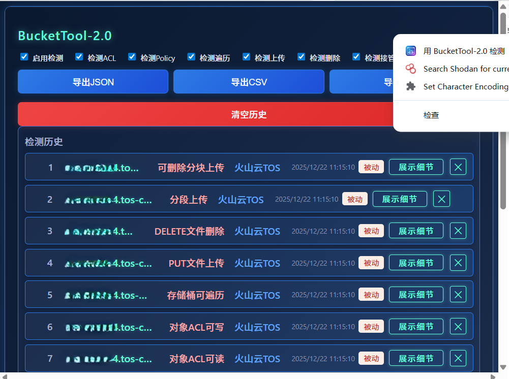
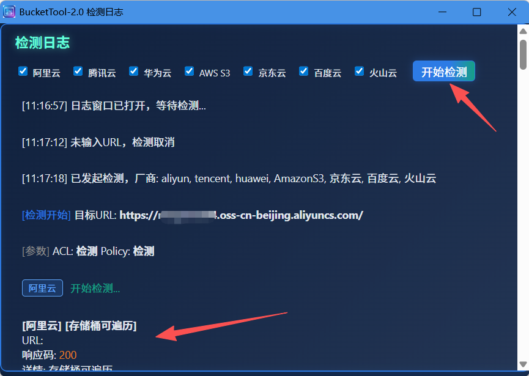
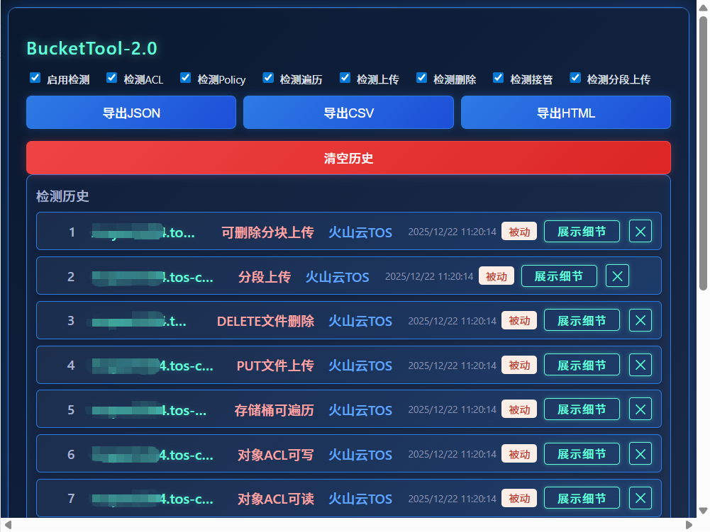
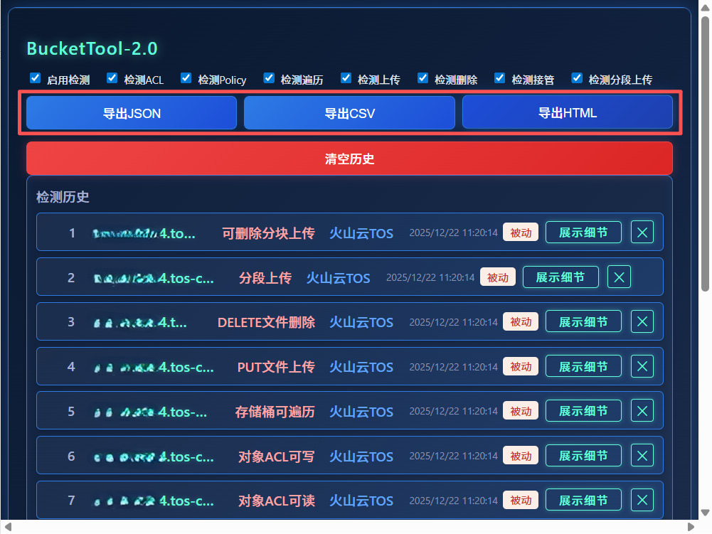
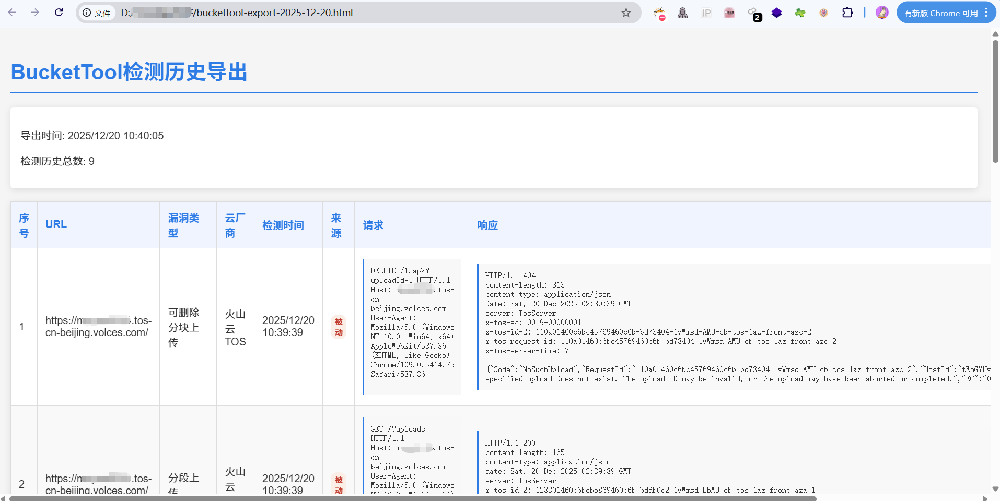

# BucketTool-2.0

## Project Introduction

BucketTool-2.0 is a browser extension used to detect common security vulnerabilities in mainstream cloud storage buckets (such as Aliyun OSS, Tencent COS, Huawei OBS, AWS S3), including traversal, unauthorized upload, ACL/Policy configuration, bucket takeover, etc. Due to the previous BurpSuite plugin needing to consider version compatibility, it has been transformed into a browser extension for convenient use.

## Main Features
- One-click detection of common bucket vulnerabilities
- Supports Aliyun, Tencent Cloud, Huawei Cloud, AWS S3, JD Cloud, Baidu Cloud, Volcano Cloud
- Real-time log display of detection results, structured historical records
- Red dot notification for detection results, click the popup to view history
- Only outputs detailed logs during active detection, passive detection only writes to history
- Supports detection function switch control, can flexibly enable/disable various detection items
- Supports exporting detection history to JSON, CSV, HTML formats, including complete vulnerability information and data packets

## Supported Cloud Vendors
- Aliyun OSS
- Tencent Cloud COS
- Huawei Cloud OBS
- AWS S3 (including China region)
- JD Cloud
- Baidu Cloud BOS
- Volcano Cloud TOS

## Usage
1. **Install Extension**:
   - Enable Developer Mode on Chrome/Edge browser extension management page (chrome://extensions/) and load this project directory.
2. **Active Detection**:
   - Click the extension icon to open the log window, select vendor, enter bucket URL, and click "Start Detection".
   - Detection process and results will be displayed in real-time in the log window.
3. **Passive Detection**:
   - Automatically detects cloud storage buckets in URLs when browsing pages, records vulnerabilities in history and triggers red dot notification.

## Main Interface Description
- **Log Window**: Displays the process and results of active detection.
  - **Opening Method**: Click the extension icon, or right-click the extension icon and select "Detect with BucketTool-2.0"
  
  
  

- **Detection Switches**: Located at the top of the extension popup, can flexibly control the enabling/disabling of various detection functions.
  
  - Enable Detection: Controls whether to enable the plugin detection function
  - Detect ACL: Controls whether to detect ACL configuration
  - Detect Policy: Controls whether to detect Policy configuration
  - Detect Traversal: Controls whether to detect bucket traversal
  - Detect Upload: Controls whether to detect PUT file upload
  - Detect Delete: Controls whether to detect DELETE file deletion
  - Detect Takeover: Controls whether to detect bucket takeover risk
  - Detect Multipart: Controls whether to detect multipart upload function
  
- **History Records**: Records all detected vulnerabilities.
  

- **Export Function**: Located at the top of the extension popup, directly click the button to export detection history.
  - Export JSON: Structured data, convenient for subsequent analysis and processing
  - Export CSV: Table data, convenient for opening with Excel and other tools
  - Export HTML: Visual report, beautiful and easy to read
  - Export content includes complete vulnerability information and data packets
  
  
- **Red Dot Notification**: Displays red dot on the extension icon when new vulnerabilities are found, automatically clears after viewing history.

## Notes
- Only detects publicly accessible buckets, cannot detect private buckets requiring authentication.
- Detection requests are anonymous access, will not carry user credentials.
- Detection results are for security testing and self-inspection only, prohibited from being used for illegal purposes.

---

If you have any suggestions or questions, welcome to feedback!

## Update History

- 2025-12-20
  - New: Added Volcano Cloud TOS support, identified by Server: TosServer or x-tos-request-id response headers

  - New: Added Volcano Cloud TOS detection items, including traversal, upload, deletion, ACL, multipart upload, deletable multipart upload, etc.

  - Optimized: Volcano Cloud TOS detection logic, adapted to JSON response format

  - Fixed: JavaScript error in Volcano Cloud TOS detection

  - New: Added support for deletable multipart upload detection for all cloud vendors

  - New: Added support for object ACL read/write detection for all cloud vendors

  - Optimized: Baidu Cloud ACL detection, distinguished between bucket ACL and object ACL

  - Optimized: Tencent Cloud ACL detection, distinguished between bucket ACL and object ACL

  - Optimized: AWS ACL detection, distinguished between bucket ACL and object ACL

  - Optimized: JD Cloud detection, added support for mergeable multipart upload detection

  - Fixed: Tencent Cloud object ACL writable detection, using public-read-write instead of bucket-owner-full-control

  - Optimized: Detection logic for all cloud vendors, improved detection accuracy

  - New: Added detection function switch control, supporting enabling/disabling various detections

  - New: Detection switches include: detect traversal, detect upload, detect deletion, detect takeover, detect multipart upload

  - Optimized: Export function, changed export buttons from dropdown menu to direct buttons

  - Optimized: JSON export content, including complete data packets and metadata

  - New: Added export function support for JSON, CSV, HTML formats

  - Fixed: Missing switch parameters in background.js

  - Fixed: Missing switch condition judgment in cloud vendor detection files

    

    Export results record detailed data packets for easy direct copying

    

- 2025-12-18
  - Enhanced: AWS detection logic supports MinIO
  - New: Multi-level directory bucket listing detection, adapted to MinIO features
  - Fixed: ACL detection location, performing ACL operations in the directory where bucket listing is found
  - Optimized: Operation consistency, all operations performed in the same directory
  - Fixed: File deletion detection, using root URL to generate test file URL
  - Support: Identify MinIO through X-Amz-Request-Id response header
  - Support: Huawei Cloud identified through x-obs-request-id response header
  - New: JD Cloud support, detected through X-Jss-Request-Id or Server: jfe
  - New: JD Cloud detection items consistent with AWS, including traversal, upload, deletion, ACL, etc.
  - Fixed: Huawei Cloud multipart upload detection, supporting response tags with xmlns attribute
  - New: Baidu Cloud BOS support, identified through Server: BceBos or x-bce-request-id response header
  - New: Baidu Cloud detection items, including traversal, upload, deletion, ACL, Policy, bucket takeover, multipart upload, etc.
  - Fixed: Baidu Cloud ACL write detection logic, using JSON request body instead of header method
  - Fixed: Baidu Cloud multipart upload detection, using uploadIdMarker keyword matching
  - Fixed: Baidu Cloud PUT object double slash issue, using URL object to construct URL
  - Fixed: Baidu Cloud ACL readable detection, supporting accessControlList field matching

- 2025-12-17
  - Fixed: Tencent Cloud COS bucket detection logic optimization
  - New: Directory traversal detection supports root directory and secondary directory testing
  - Fixed: Double slash issue in ACL URL construction
  - Optimized: URL processing logic, using URL object to avoid path concatenation errors
  - New: Multipart upload detection function, supporting all cloud vendors
  - New: File deletion permission detection function, supporting all cloud vendors
  - Fixed: Huawei Cloud deletion detection logic, using root URL to generate test file URL
  - Fixed: Aliyun Policy, added bucket itself permission
  - Fixed: Aliyun Object ACL detection, performed on original object URL
  - Fixed: AWS detection function, added options parameter processing
  - Optimized: All cloud vendors bucket listing detection performed in root directory
  - Relaxed: AWS ACL detection and multipart upload detection conditions
  - New: Aliyun Policy Action changed to oss:*, granting all permissions